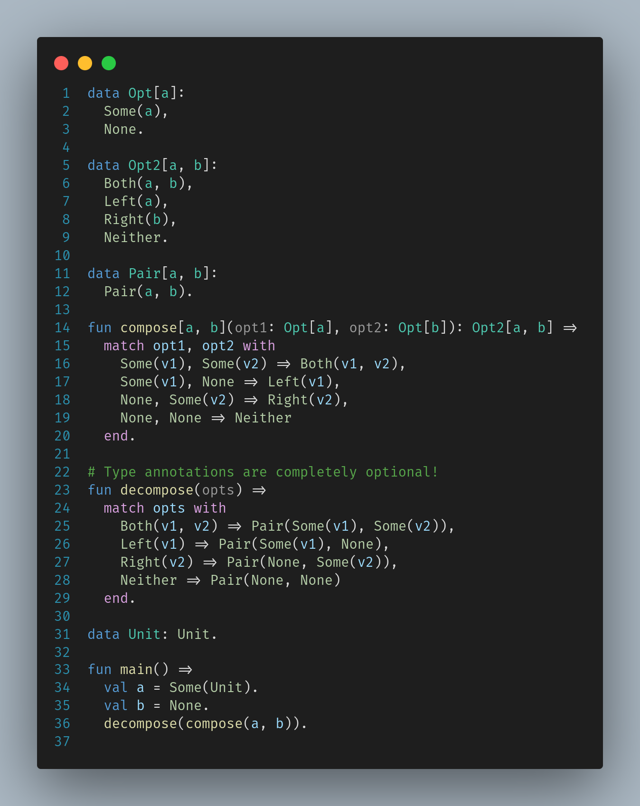

# lang2

This is a repository for lang2 programming language compiler and documentation. `lang2` is a working name and might change at any time. **Note that compiler is a work in progress and you can't run lang2 programs yet**

Lang2 is a pure, strict, and first-order programming language aiming to offer more control over memory management and runtime representation of values. Lang2 programs compile to native machine code and don't require any runtime support.

While lang2 is not a higher-order functional programming language like OCaml or Haskell, it targets a similar niche - lang2 features support for algebraic data types and generics and it will eventually be extended to support typeclasses/modules, allowing many functional idioms to be expressed in lang2. Actual higher order functional programs in lang2 would be eventually expressible, although not as idiomatically as in OCaml or Haskell.

Typesystem of lang2 is based on Damas–Hindley–Milner typesystem, ensuring that one can write lang2 programs with minimal number of type annotations and get principal types inferred automatically. lang2 supports type annotations with scoped type variables (all type variables in lang2 need to be explicitely introduced). 

Below is a simple example of what lang2 code might look like.

</img>

One can note that lang2, unlike OCaml and Haskell, does not use juxtaposition for function calls. The reasons for that are as follows.

* There is no plan to support currying in lang2, and juxtaposition syntax would imply its supported.

* Juxtaposition syntax for function calls is confusing to people who haven't programmed in OCaml and Haskell (or similar languages). Having TAed Haskell classes, I have seen people initially struggle with juxtaposition for function calls.

* Lang2 has been designed to be a language that is extremely easy to parse, ensuring that parser could be easily ported to new parser tooling/implementation language. My goal is to have LL(1) grammar for lang2 at all times.

## Summary

Eventual goals for lang2 are as follows

* Purity. Effect system ensures that all side-effects from a function are expressed in type signature. Purity ensures that calls to functions can be removed, reordered, and deduplicated. Compiler friendly evaluation semantics (inspired by C++ forward progress guarantee[1](#myfootnote1)) gives opportunities to perform these optimizations even if compiler can't prove termination of dead code. Region variables allow for aliasing analysis with respect to reads/writes.

* Strictness. Strict evaluation makes it easier to reason about how program executes and performs. This is especially important when writing impure (i.e. effectful) code.

* HM-based type system. Good type inference is essential, as the ability of type inference algorithm to infer most general (principal) type allows to have functions that work transparently with pointers into different regions.

* Effect system. lang2 code that reads from/writes to memory in regions is labeled, distinguishing it clearly from pure code. Again, this enables better compiler optimizations.

* Substructural type system. Lang2 aims to have first-class support for linear types, linearity polymorphism and in-place updates to support FBIP (functional but in place paradigm).

* Regional memory management. Lang2 uses regions as its main memory management strategy. Lang2 programs would be able to manipulate muliple regions simultaneously. The type system would guarantee safety even when dangling pointers (pointers to deallocated regions) are present. Support for existentially wrapped regions would allow for returning complex data structures 

---------------

<a name="myfootnote1">1</a> Note that there are no negative consequences to writing side-effect-free non-terminating code in lang2 other than the fact that its evaluation might be skipped. In particular, there is no notion of unconstrained UB in lang2 and set of executions is (in my opinion sensibly) bounded.
